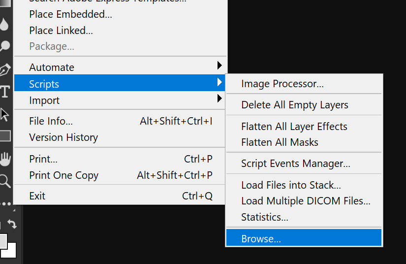
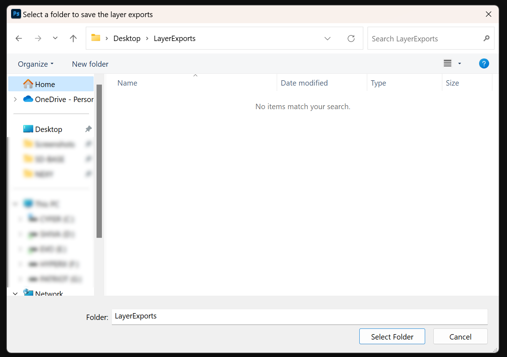
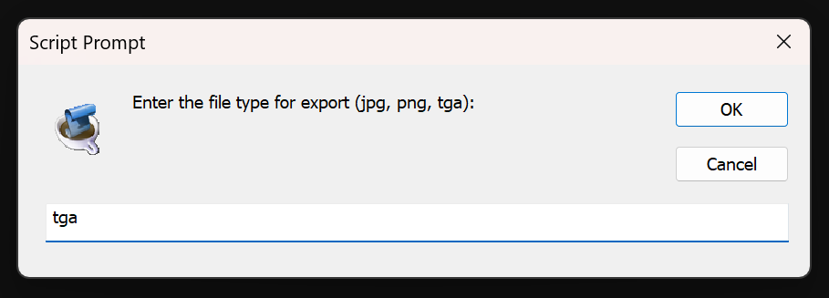
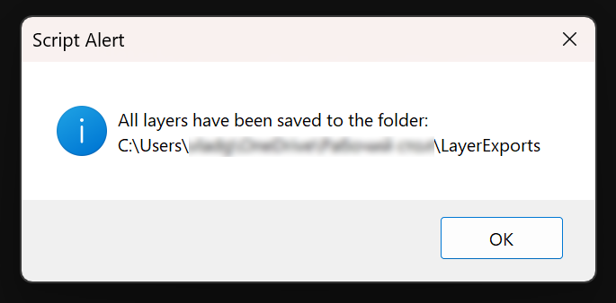

# Photoshop Layer Export Script

This script automates the process of exporting each layer in an Adobe Photoshop document as a separate image file.

## Prerequisites

- Adobe Photoshop must be installed.
- The script file `PS_Layer_Export.jsx` must be downloaded to your local machine.

## Usage

1. **Starting the Script**:
    - Open Adobe Photoshop and load the document containing the layers you wish to export.
    - Navigate to `File` > `Scripts` > `Browse` and select the `PS_Layer_Export.jsx` script to run it.

    

2. **Selecting Export Folder**:
    - A dialog will appear asking you to select a folder for the exported images.
    - Choose the desired folder and click `Select Folder`.

    

3. **Choosing File Format**:
    - A prompt will ask for the file type you wish to export the layers as (`jpg`, `png`, or `tga`).
    - Enter your choice and click `OK`.

    

4. **Export Process**:
    - The script will iterate through each layer, turning them on one by one, and save them as the selected file type in the chosen folder.
    - Once complete, a confirmation alert will display the location of the saved files.

5. **Checking Exported Files**:
    - Navigate to the selected folder on your desktop to view the exported images.

    

## Notes

- The script will save the layers in numerical order based on their position in the layer stack.
- Background layers are not exported.
- If `jpg` or `tga` is selected, images will be saved with maximum quality.
- If `png` is selected, images will be saved with their existing transparency.

## Troubleshooting

- If no files appear in the selected folder, ensure you have write permissions for the folder and that Photoshop has access to it.
- If the script fails to run, check that you have a document open in Photoshop with available layers.

For further assistance, please open an issue on the repository or contact support.
